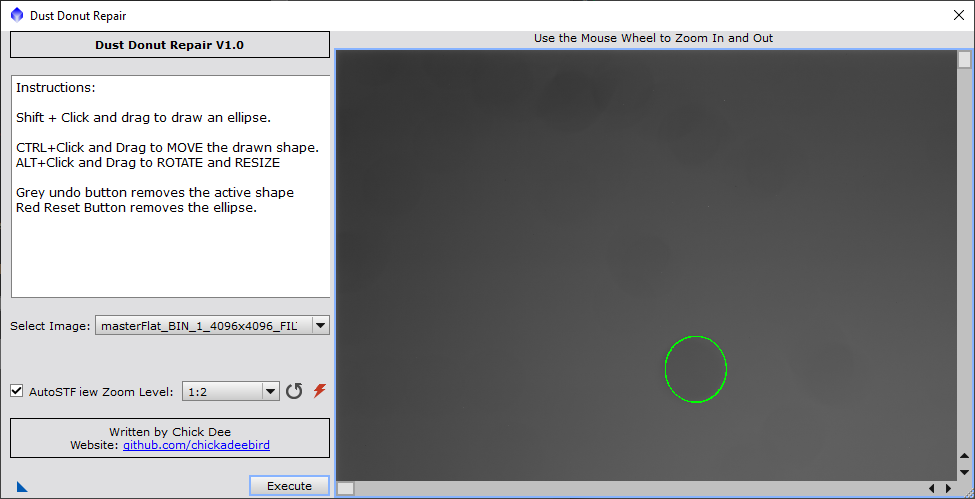

# Dust-Donut-Repair
This is a Pixinsight script for repairing dust donuts from mismatching of flats to image frames.
The script will display any available image window in its image window frame.
The user can select an ellipse to place a ring around the offending dust donut (shift button down, and left mouse button down and drag).
If the selection is imperfect, either Ctrl+left mouse button will modify the selection, or start over by shift+left mouse button as above.
Once the selection is made, the execute button will modify the image window open in Pixinsight.
At present, until I can find some RGB images, this only works on mono images.

## Images

This is a sample pair of images.

## Script

This is the script interface.

## Manage repository location

In order to automatically refresh the script in Pixinsight, add this following to Resources > Updates > Manage repositories

https://raw.githubusercontent.com/chickadeebird/pixinsight-updates/main/
